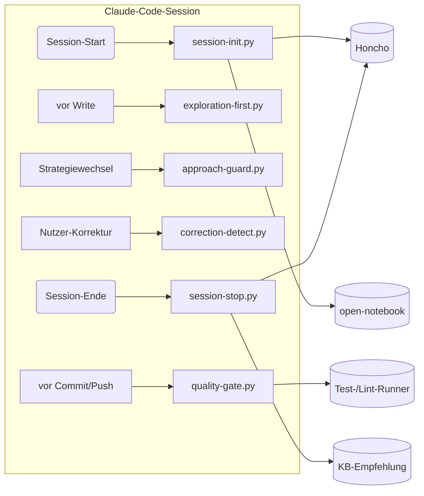

# meta-skills-plugin

**Enterprise Quality Engine für AIE-Runtimes.** Gemeinsame Skills und Governance-Regeln
werden pro Anwendung über eine kleine Adapter-Schicht geladen; Claude-Code-Hooks und
OpenCode-Plugins bleiben bewusst runtime-spezifisch.

## Runtimes

- **Claude Code:** Plugin-Manifest, Commands, Agents und Claude-spezifische Hooks.
- **OpenCode:** Adapter unter `integrations/opencode/`, der die gemeinsamen `skills/`
  lädt und den Mattermost-MCP mit einer expliziten Peer-Identität startet.

Der erste gemeinsame Cross-Runtime-Skill ist `skills/peer-comms/`: Brain und Vibe
kommunizieren über `aie-mm-mcp` unter getrennten Rollen; Gitea bleibt der dauerhafte
Arbeits- und Belegkanal.

Die schrittweise OpenCode-Übernahme ist in
[`integrations/opencode/ROADMAP.md`](integrations/opencode/ROADMAP.md) dokumentiert:
gemeinsame Skills werden qualifiziert, während Claude-Code-spezifische Hooks, Agents
und Commands nur über gleichwertige native OpenCode-Mechanismen übernommen werden.

## OpenCode Peer Messaging — Current State

**Stand: 2026-07-29.** `peer-comms` is the first active cross-runtime Meta-Skill. The
OpenCode adapter contains separate Brain/Vibe profiles, global start commands
`opencode-brain` and `opencode-vibe`, a role-bound Mattermost inbox helper, and an OpenCode
plugin that injects new peer input into the active matching session. The implementation is
committed to Gitea in `417960d`.

Reach both peers through the shared Mattermost channel:

```text
[joe -> @brain @vibe] <message>
```

A DM from Joe or the other peer reaches only the peer who receives it; use the shared channel
for a request both peers must see.

**Operating status:** unit gates and read-only role/vault inbox checks passed, but end-to-end
automatic delivery is **not accepted yet**. The final Brain OpenCode runtime probe reached
session creation and then received Phantom Bridge `401 CLIENT_UNAUTHORIZED`.

| Need | Source of truth |
|---|---|
| Start, roles, channels, and limitations | [`integrations/opencode/STATUS.md`](integrations/opencode/STATUS.md) |
| Open work and acceptance checks | [`integrations/opencode/TODO.md`](integrations/opencode/TODO.md) |
| Corrections and reusable learnings | [`integrations/opencode/LEARNINGS.md`](integrations/opencode/LEARNINGS.md) |
| Architecture and staged adoption | [`integrations/opencode/ROADMAP.md`](integrations/opencode/ROADMAP.md) |
| Peer message convention | [`skills/peer-comms/SKILL.md`](skills/peer-comms/SKILL.md) |

## Warum wir es haben

Claude-Code-Sessions laufen ohne dieses Plugin ungeprüft: keine automatische Korrektur-Erkennung, kein Read-before-Write-Zwang, kein Gate gegen fehlgeschlagene Tests/Lints vor Commit/Push. `meta-skills-plugin` ist der Versuch, diese Lücke strukturell zu schließen — nicht per Prosa-Regel in einer CLAUDE.md, sondern per Hook, der bei definierten Events (Session-Start, Session-Stop, vor Approach-Wechsel, vor Write, vor Commit) tatsächlich läuft. Es ist laut `WAS-WIR-HABEN.md` die mit Abstand größte Testsuite im Bestand (444 Tests) und beansprucht, „alle 7 Forschungsprinzipien" für zuverlässige Agenten-Arbeit umzusetzen (Adversarial Review, CI/CD-Gates, Cross-Model-Refinement).

Der Bestand-Status ist aber ausdrücklich gemischt: `WAS-WIR-HABEN.md` führt es unter „Gebaut, kein Aufrufer" mit dem Vermerk **„läuft als Hook, F2: 0/23 Wirk-Beleg"** — das Plugin ist technisch vorhanden und als Hook eingehängt, aber es gibt (Stand des zugrundeliegenden Audits) für 0 von 23 geprüften Punkten einen gemessenen Wirksamkeits-Beleg. Gebaut ≠ aktiviert+gemessen+genutzt (Memory-Doktrin) — genau diese Lücke besteht hier noch.

## Aufbau (bekannter Teil)

```
meta-skills-plugin/
├── .claude-plugin/          # Plugin-Manifest (plugin.json)
├── .claude/                 # Claude-Code-lokale Konfiguration
├── hooks/
│   ├── hooks.json            # 7 Events, 16 Hooks
│   └── lib/
│       ├── config.py          # zentrale, tunbare Settings
│       ├── services.py        # geteilte Clients (Honcho, open-notebook, vault)
│       └── hook_wrapper.py    # gemeinsame Hook-Utilities
│   ├── session-init.py       # Session-Start: Honcho + open-notebook + CI + Watcher-Check
│   ├── session-stop.py       # Session-Ende: Auto-Summary + Honcho + KB-Empfehlung + P7-State
│   ├── correction-detect.py  # Korrektur-Erkennung + S10-Compliance
│   ├── scope-tracker.py      # Themenwechsel-Hinweis (ab 3+ Wechseln)
│   ├── approach-guard.py     # blockt unautorisierten Strategiewechsel
│   ├── exploration-first.py  # Read-before-Write-Zwang (Prinzip P5)
│   └── quality-gate.py       # Test-/Lint-Fail-Gate vor Commit/Push
├── agents/                  # 6 Agents (❓ Namen/Zweck nicht im gelesenen Kontext)
├── commands/                 # 17 Slash-Commands (❓ Namen nicht gelesen)
├── skills/                   # 16 Skills (❓ Namen nicht gelesen, siehe SKILLS_INDEX.md im Repo)
├── scripts/                  # 27 Support-Skripte
├── oversight/                # ❓ Inhalt nicht gelesen
├── plans/                    # ❓ Inhalt nicht gelesen
├── self-improving/           # ❓ Inhalt nicht gelesen (Name deutet auf Selbstkorrektur-Loop)
├── docs/                     # Dokumentation
├── tests/                    # 444 Tests (größte Suite im Bestand)
├── SKILLS_INDEX.md
├── CHANGELOG.md
└── CLAUDE.md
```



Das Diagramm zeigt nur die 7 im Kontext gelesenen Hooks von 16 insgesamt — die übrigen 9 Hooks sowie alle Skills/Commands/Agents sind ❓ nicht aus dem gelesenen README-Ausschnitt bekannt.

## Was / Wo / Wer

| Was | Wo | Wer nutzt es |
|---|---|---|
| Plugin-Code (SSOT) | Gitea `joe/meta-skills-plugin` | Joe (Owner), Claude-Code-Instanzen die es installieren |
| Ursprungs-/Parallel-Repo | `.91` `phantom-ai/meta-skills` (laut ERP-Task-Kontext, ❓ genaue Beziehung zu diesem Gitea-Repo ungeklärt) | Legacy-Referenz für Migration |
| Installation | lokal via `claude plugins marketplace add ./meta-skills` + `claude plugins install meta-skills@meta-skills-local` | jede Claude-Code-Session, die das Plugin aktiviert |
| Hooks-Laufzeit | in-process bei Claude-Code-Events (kein eigener Host:Port, kein Dienst) | Claude-Code-Harness selbst |
| Testsuite | `tests/` (444 Tests) | CI/CD-Gate, lokale Verifikation |

## Vernetzung

- **`kb/ops/WAS-WIR-HABEN.md`** — führt den Bauteil-Status: „gebaut, kein Aufrufer", **F2: 0/23 Wirk-Beleg**.
- **`kb/ops/organism/erp-tasks-uebersicht.md`** — ERP-Task #00621 „Pi-Mono Migration meta-skills" (toter Owner) sowie M126-Warnung zu Tasks #00205/#00242, die vor Close einen Live-`ls`-Beleg auf `phantom-ai/meta-skills/.claude/rules/17-git-workflow.md` bzw. `.91:Documents/CLAUDE.md` verlangen — nicht automatisch auf „Completed" flippen.
- **`kb/ops/organism/glossar-und-gitea-accounts.md`** — `meta-skills-plugin` steht dort in einer Zeile mit `hermes-dispatcher-watcher`, `hermes-mm-heal`, `kb-currency-keeper` (❓ genauer Bezug — vermutlich Gitea-Account/Bot-Liste, nicht im Detail gelesen).
- **`~/.claude/CLAUDE.md` (global)** — die Prinzipien, die dieses Plugin technisch erzwingen will (Verify-vor-Behaupten, KEIN-MOCK, Read-before-Write), sind dieselben, die im globalen CLAUDE.md als Advisory-Regeln stehen. Das Plugin ist der Versuch, einen Teil davon von L1 (advisory) nach L3 (deterministisch/Hook) zu heben.
- **CI/CD** — laut Beschreibung „CI/CD-Gates" Teil des Feature-Sets; `.github`-Verzeichnis im Repo vorhanden (❓ Details nicht gelesen).

## Status + nächste Schritte

**Ehrlich:** Das Plugin ist gebaut, dokumentiert (CHANGELOG.md, SKILLS_INDEX.md, eigenes CLAUDE.md, 444 Tests) und laut Bestandsregister „läuft als Hook" — aber es fehlt der Wirksamkeits-Beleg. `F2: 0/23` heißt: von 23 geprüften Punkten hat keiner einen gemessenen Nachweis, dass der Hook im Live-Betrieb tatsächlich wirkt (nicht nur eingehängt ist). Das ist exakt der Fall, den die Bau-Doktrin „gebaut ≠ aktiviert+gemessen+genutzt" markiert.

Nächste Schritte (aus dem Kontext ableitbar, nicht als bereits erledigt behauptet):
1. F2-Audit-Quelle identifizieren und die 23 Punkte einzeln mit Live-Beleg (Hook feuert nachweislich in einer echten Session, Effekt beobachtbar) durchgehen.
2. Beziehung zu `phantom-ai/meta-skills` auf `.91` klären — ist `joe/meta-skills-plugin` reiner SSOT-Spiegel oder divergiert der Code? (ERP-Tasks #00205/#00242 offen, kein Auto-Close ohne Live-`ls`-Beleg.)
3. Fehlenden Rest der Architektur (agents/, commands/, skills/, oversight/, plans/, self-improving/) dokumentieren — dieser README-Entwurf kennt nur den Hook-Teil.
4. Owner für ERP-Task #00621 („toter Owner") klären, bevor weitere Migrationsarbeit angesetzt wird.

## Fußzeile

- Bestands-SSOT: `kb/ops/WAS-WIR-HABEN.md`
- Organism-Kontext: `kb/ops/organism/erp-tasks-uebersicht.md`, `kb/ops/organism/glossar-und-gitea-accounts.md`
- Lizenz: ❓ nicht aus Repo-Kontext ersichtlich — vor externer Weitergabe im Repo selbst (`LICENSE`, falls vorhanden) prüfen.
- Dieses README wurde aus einem begrenzten Repo-Kontext-Auszug erstellt (39 Zeilen: Top-Level-Struktur + Kopf des existierenden READMEs). Vollständige Skills-/Commands-/Agents-Liste vor nächster Überarbeitung aus `SKILLS_INDEX.md` und dem echten Repo nachziehen.
